# Taipy Sales Kit

  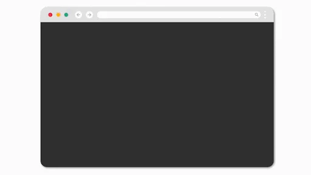

## Introduction

This repository aims to provide anyone with the tools (decks and demos) to present, defend and sell Taipy in front of leads, customers, partners, investors, etc.

> [!CAUTION]  
> This repository is private. It contains sensitive information and closed-source code. Share it with caution.

## Table of contents

- [Introduction](#introduction)
- [Table of contents](#table-of-contents)
- [Taipy's Value Proposition](#taipys-value-proposition)
- [Slides](#slides)
- [Demos](#demos)
  - [Front End](#front-end)
  - [Predictive Layer](#predictive-layer)
  - [Competitor Comparison](#competitor-comparison)
  - [Scenario](#scenario)
  - [Designer](#designer)
  - [Markdown Preview](#markdown-preview)
- [General Sales Strategy](#general-sales-strategy)
- [Addressing Competitors](#addressing-competitors)
  - [Streamlit or similar](#streamlit-or-similar)
  - [Plotly Dash or similar](#plotly-dash-or-similar)
  - [PowerBI or similar](#powerbi-or-similar)
- [Addressing Concerns](#addressing-concerns)
  - [Security](#security)
  - [Integration](#integration)

## Taipy's Value Proposition

1. **The Problem**: Low success rate of data projects
2. **The Cause**: Data engineers are not aligned with the end users. They have to go through DevOps and Front End teams before they can show their work to the business side.
3. **The Solution**: Taipy is a Python library that allows data engineers to create interactive web applications without having to learn new languages or frameworks. It allows them to work directly with the business to create applications that are aligned with their needs.

## Slides

The `Slides` folder contains a few decks:
- `main_deck` is a short 8-slide deck that focuses on a quick story-telling: problem -> cause -> solution -> result -> positioning
- `extended_deck` contains additional information such as customer testimonials, enterprise features, etc.
- `sales_doc.pdf` is a detailed sales guide which contains all the information needed to sell Taipy, including the sales strategy, the value proposition, the competitive landscape...
- `pricing` contains our pricing policy

  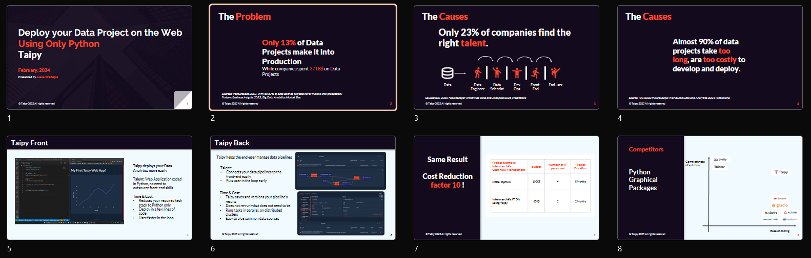

## Demos

Here is the list of our available demos in the order we usually present them. Read their installation instructions carefully. You should also present the demos in our <a href="https://docs.taipy.io/en/release-3.1/gallery/" target="_blank">Documentation</a>.

### Front End

The `Demos/Front End` folder contains simple demos that focus on the ease of use of Taipy.

> [!IMPORTANT]  
> To run these demos, set your current working directory to the `Demos/Front End` folder (Using `Open Folder...` in VSCode for example). Then, install the requirements with `pip install -r requirements.txt`.

  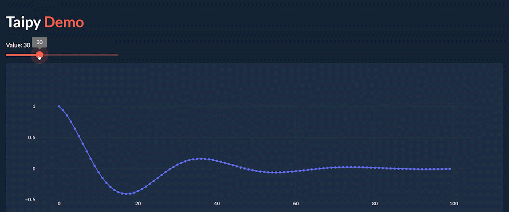

- `markdown_syntax.py` is the entry point to learn Taipy, it shows a simple slider and chart interaction.
- `python_syntax.py` is the same but showcases the use of Python syntax to create the UI.
- `callback.py` is the same again but explains the use of callbacks to execute code on a user interaction.
- `plotly_support.py` shows how easily Plotly charts can be embedded in a Taipy application while retaining interactivity and performance.
- `multi_user.py` shows Taipy's multi-user capabilities. Open the application in one tab and re-open it in an incognito tab to show a chat between two users.

  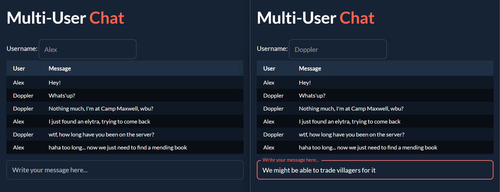

  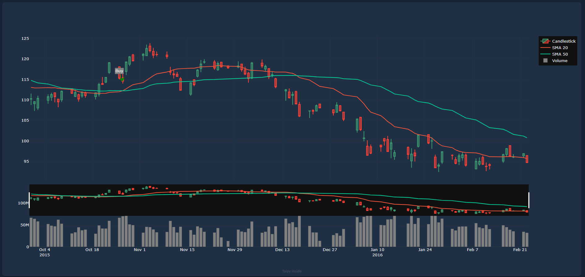

### Predictive Layer

The `Demos/Predictive Layer` folder contains a mock version of a real commodity trading application we did for Predictive Layer to replace PowerBI. It is a good showcase of Taipy's capabilities to create complex applications.

> [!IMPORTANT]  
> To run this demo, set your current working directory to the `Predictive Layer` folder (Using `Open Folder...` in VSCode for example). Then, install the requirements with `pip install -r requirements.txt`.

  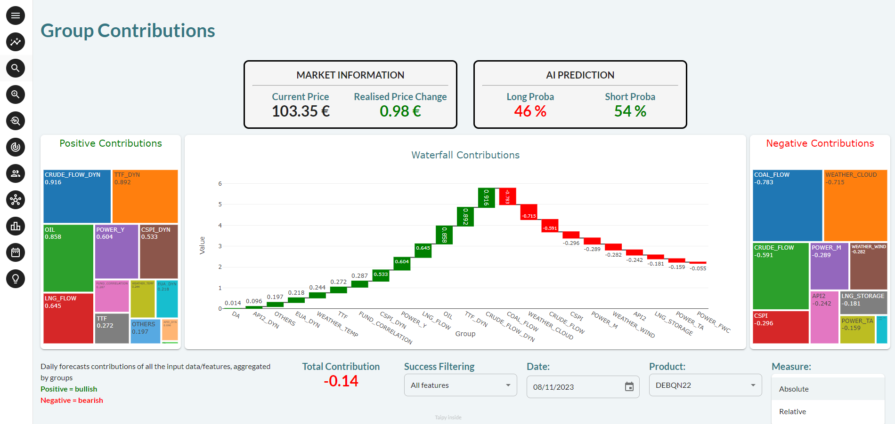

To present this demo, run `main.py` and look at the different pages. It is a mock application so there is no interactivity but explain that Taipy can handle multiple pages, users, complex charts and tables.

On the Group Contribution page, double-click on the scaffolding chart to show that Taipy can trigger Python code when a user interacts with a chart.

### Competitor Comparison

The `Demos/Competitor Comparison` folder contains demos that compare Taipy with Streamlit to insist on our performance advantage.

> [!IMPORTANT]  
> To run these demos, set your current working directory to the `Demos/Competitor Comparison` folder (Using `Open Folder...` in VSCode for example). Then, install the requirements with `pip install -r requirements.txt`. Streamlit examples can be run with `streamlit run <filename>`.

  

- `map` is a map example that shows that Taipy updates data in real-time while Streamlit flickers.
- `large_dataset` is about plotting 1M points within a chart. Taipy can do it in real-time while Streamlit freezes for 10 seconds.

  

### Scenario

The `Demos/Scenario` folder contains a demo that showcases Taipy's Scenario Management capabilities.

> [!IMPORTANT]  
> To run this demo, set your current working directory to the `Demos/Scenario` folder (Using `Open Folder...` in VSCode for example). Then, install the requirements with `pip install -r requirements.txt`. You also need the VSCode extension `Taipy Studio` installed.

Here are the steps to present this demo:

  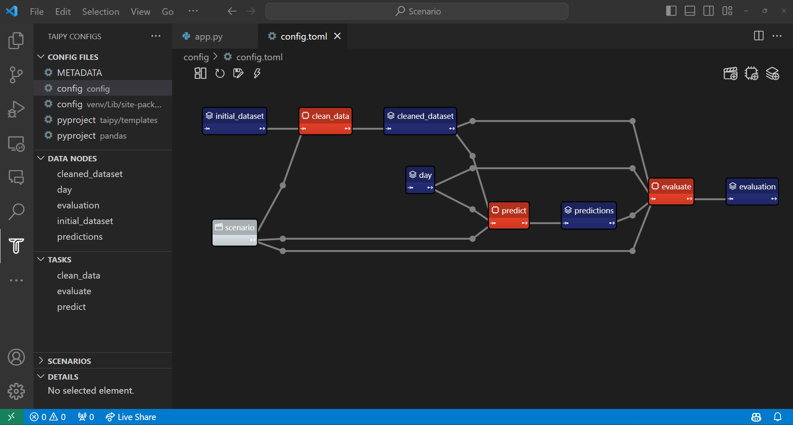

1. Open config.toml using Taipy Studio
2. Explain that blue nodes are data nodes that represent data: CSV, SQL, Parquet, Mongo, a Python variable that the end user selected on the interface...
3. Explain that orange nodes are task nodes which are Python functions that convert data into new data. Give an example by showing the code of a node.
4. Explain that this framework comes with many functionalities:
    - Results of executions are registered and versioned which allows for tracking KPIs over time and comparing different scenarios.
    - Tasks can be run in parallel and distributed on a cluster.
    - Taipy comes with pre-built UI components to interact with these scenarios.
5. Run `app.py`
6. Create a scenario
7. Change the date of prediction

  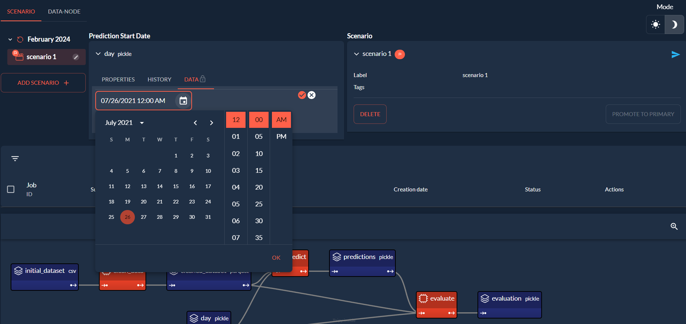

8. Submit the scenario
9.  Visualize the results on the second page

  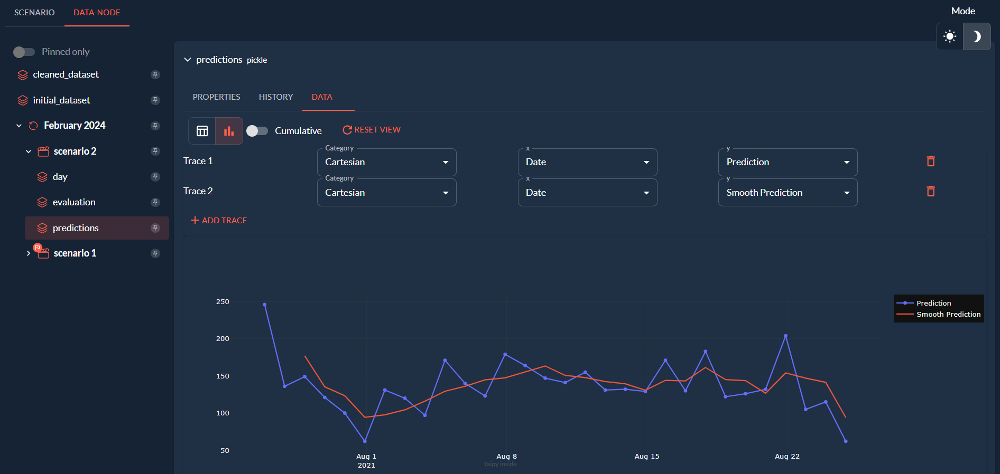

10. Create a new scenario with another input date
11. The `job_selector` will show that `clean_data` has been skipped. This is called caching: Taipy knows that the data has not changed and that the result will be the same so it skips the execution.

  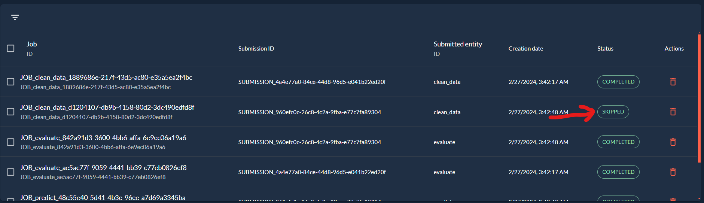

### Designer

The `Demos/Designer` folder contains a demo that showcases the Taipy Designer product which allows users to create a front-end without writing any code, only by dragging and dropping components.

> [!IMPORTANT]  
> To run this demo, set your current working directory to the `Designer` folder (Using `Open Folder...` in VSCode for example). To use Taipy Designer, install with pip in the following order: `pip install -r requirements.txt`, `pip install taipy-3.2.0.dev0-py3-none-any.whl`, `pip install taipy-designer-0.5.6.tar.gz`

  

To present this demo:
1. Quickly show the `eco2mix_plotly_page.py` code to show that it contains a date variable, a bool variable and two plotly charts.
2. Run `eco2mix_plotly_demo.py` and show the interface and the available widgets.
3. Use the Plotly Python Generic widget and connect it to `fig_data`

  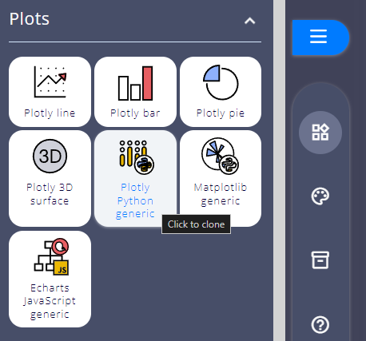

  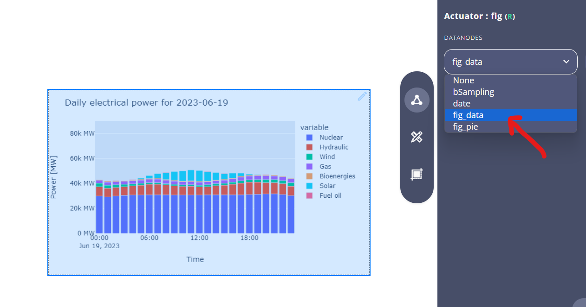

4. Use the Switch widget and connect it to `bSampling`
5. Click on View at the top right and click on the switch to show the chart updating in real-time.
6. Keep adding to the interface by creating a second plotly chart, a Simple Calender widget to pick the date, and a Label widget for the title
7. You can edit the style of the widgets using the right panel.

  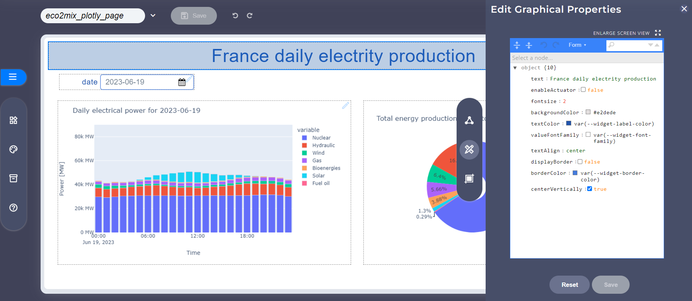

### Markdown Preview

The `Demos/Markdown Preview` folder contains two markdown files to showcase the markdown preview feature of Taipy Studio.

> [!IMPORTANT]  
> To run this demo, install the Taipy Studio extension in VSCode.

You can then preview the markdown files by pressing the button at the top right of the editor.

  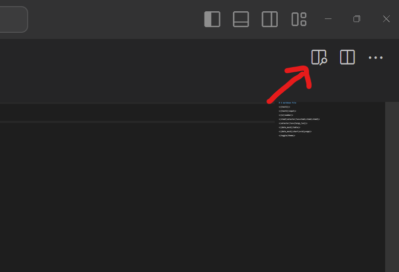

  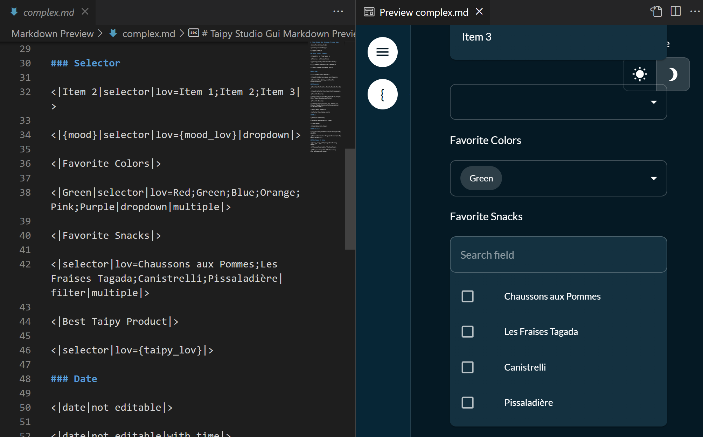

## General Sales Strategy

1. Ask questions to understand the audience's needs: what projects do they work on? Do they use Python? What tools do they use? What are their pain points?
2. Present Taipy by focusing on our differentiations with their current tools and how we can solve their pain points.
3. Show demos that are relevant to their needs.

## Addressing Competitors

### Streamlit or similar

- We retain the ease of use of Streamlit while being able to scale to production applications with multiple pages/users, and large datasets/models.
- Show [Competitor Comparison](#competitor-comparison)

### Plotly Dash or similar

- Plotly has a steep learning curve which forces your data team to rely on specialists. Taipy is designed to be used by anyone who knows Python so that the whole team can contribute.
- Focus on [Front End](#front-end)

### PowerBI or similar

- BI tools are static and not interactive. They only connect to a data source and display static charts. Taipy creates interactive web applications that can be used collaboratively.
- Show [Predictive Layer](#predictive-layer)

## Addressing Concerns

### Security

- Taipy does not have a Cloud offering. We do not store any data. Everything is run on the customer's infrastructure.
- We do not mention "Open Source". If the customer mentions it, we say that we have already been vetted by security teams at large companies.

### Integration

- Taipy is Cloud agnostic. It can be run on any common Cloud provider (Azure, AWS, GCP)
- Taipy can be integrated within most data platforms (Databricks, Dataiku, SageMaker, etc.)
